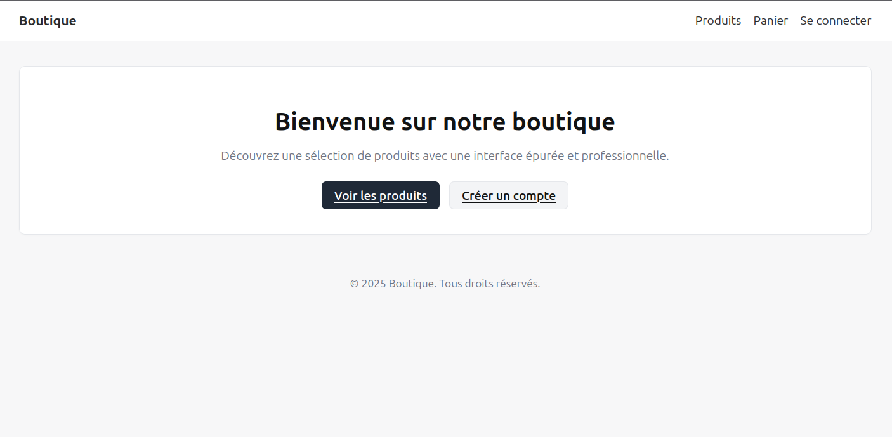

# MVC2 JPA — Mini e-commerce (Jakarta EE 11, Hibernate, JSP)

Une application e-commerce pédagogique (vitrine, panier, commandes, compte) construite avec Jakarta EE 11 (Servlet/JSP), Hibernate ORM 6 (JPA), MySQL et packagée en WAR.



## Sommaire
- Aperçu des fonctionnalités
- Stack technique
- Démarrage rapide
- Configuration base de données (MySQL)
- Sécurité (accès protégés)
- Scripts SQL de jeu de données (seed)
- Construction et exécution Docker
- Arborescence du projet
- Notes et limitations

---

## Aperçu des fonctionnalités
- Vitrine des produits et recherche
- Détails d’un produit
- Gestion de panier (ajout, mise à jour, suppression, vider)
- Passage de commande depuis le panier et confirmation
- Historique des commandes + détail d’une commande
- Espace compte (profil basique), inscription et connexion

UI sobre et professionnelle (noir/gris/blanc), avec Tailwind via CDN et de petits widgets réactifs (quantité) en React (Babel in-browser). Une feuille de style globale `neutrals.css` harmonise l’ensemble.


## Stack technique
- Langage/Build: Java 21, Maven 3.9+
- Web/API: Jakarta EE 11 Web (Servlet 6, JSP), JSTL (jakarta.tags.*)
- ORM/JPA: Hibernate ORM 6
- Base de données: MySQL 8+
- Vue: JSP + Tailwind CDN + React (widgets quantité)
- Packaging: WAR
- Conteneur de servlets: Tomcat 10.1 (via Dockerfile fourni) ou serveur d’applications Jakarta (ex: WildFly)

> Vérifié dans le code: les entités JPA s’appellent `Produit`, `Internaute`, `Commande`, `LigneCommande`, `Panier`, `LignePanier`. Le `persistence.xml` est configuré pour MySQL et JTA (JNDI `java:jboss/datasources/MySqlDS`).


## Démarrage rapide
Pré-requis:
- Java 21, Maven 3.9+
- MySQL 8+ disponible

Build du WAR:
```bash
mvn clean package -DskipTests
```
Le WAR est produit dans `target/mvc2_jpa-1.0-SNAPSHOT.war`.

Déploiement (au choix):
- Serveur Jakarta EE/JTA (recommandé, ex: WildFly): configurez une DataSource JNDI `java:jboss/datasources/MySqlDS` (voir section suivante) puis déployez le WAR.
- Tomcat 10.1: possible mais nécessite de définir une ressource JNDI équivalente ou d’ajuster `persistence.xml` en `RESOURCE_LOCAL`. Voir Notes/Limitations.

URL par défaut après déploiement: `http://localhost:8080/`


## Configuration base de données (MySQL)
1) Créez la base et l’utilisateur (exemple):
```sql
CREATE DATABASE IF NOT EXISTS ecommerce CHARACTER SET utf8mb4 COLLATE utf8mb4_unicode_ci;
CREATE USER IF NOT EXISTS 'ecom_user'@'%' IDENTIFIED BY 'ecom_pass';
GRANT ALL PRIVILEGES ON ecommerce.* TO 'ecom_user'@'%';
FLUSH PRIVILEGES;
```

2) Créez une DataSource JNDI dans votre serveur d’appli:
- WildFly (exemple): définissez la datasource `java:jboss/datasources/MySqlDS` pointant vers `jdbc:mysql://host:3306/ecommerce` avec le driver MySQL.
- Tomcat: créez un `Resource` JNDI équivalent (nom, URL, user/pass) dans le `context.xml` de Tomcat et alignez `persistence.xml` (JTA vs non-JTA). Voir la section Notes.

3) Le projet est configuré avec:
- Dialecte: `org.hibernate.dialect.MySQLDialect`
- hbm2ddl: `update` (crée/altère le schéma au démarrage)


## Sécurité (accès protégés)
Un filtre `AuthFilter` protège toutes les ressources sauf:
- Pages publiques: `/`, `/index.jsp`, `/assets/*`, `/produits*`, `/pages/produit/*`, `/favicon*`
- Authentification: `/compte/showLogin`, `/compte/login`, `/compte/showRegister`, `/compte/register`

Les zones protégées (ex: `/panier`, `/commande`, `/compte/profile`) nécessitent une session avec l’attribut `user`. Sinon, redirection vers la page de login avec un paramètre `next` pour revenir à l’URL initiale après connexion.


## Scripts SQL de jeu de données (seed)
Collez ces requêtes après avoir configuré la base (elles supposent le schéma/labellisation par défaut générés par Hibernate, en cohérence avec les entités):

```sql
START TRANSACTION;

-- Internautes
INSERT INTO `Internaute` (`nom`, `prenom`, `email`, `motDePasse`)
VALUES ('Dupont', 'Alice', 'alice@example.com', 'secret');
SET @u1 := LAST_INSERT_ID();

INSERT INTO `Internaute` (`nom`, `prenom`, `email`, `motDePasse`)
VALUES ('Martin', 'Bob', 'bob@example.com', 'secret');
SET @u2 := LAST_INSERT_ID();

-- Produits
INSERT INTO `Produit` (`nom`, `description`, `prix`, `quantite`)
VALUES ('Clavier mécanique', 'Clavier switchs rouges format TKL', 79.90, 50);
SET @p1 := LAST_INSERT_ID();

INSERT INTO `Produit` (`nom`, `description`, `prix`, `quantite`)
VALUES ('Souris optique', 'Souris 6 boutons 16000 DPI', 24.90, 120);
SET @p2 := LAST_INSERT_ID();

INSERT INTO `Produit` (`nom`, `description`, `prix`, `quantite`)
VALUES ('Écran 27" IPS', 'Écran 27 pouces 144Hz IPS', 249.00, 20);
SET @p3 := LAST_INSERT_ID();

INSERT INTO `Produit` (`nom`, `description`, `prix`, `quantite`)
VALUES ('Casque audio', 'Casque circum-aural micro détachable', 59.00, 70);
SET @p4 := LAST_INSERT_ID();

INSERT INTO `Produit` (`nom`, `description`, `prix`, `quantite`)
VALUES ('Webcam HD', 'Webcam 1080p autofocus', 39.00, 80);
SET @p5 := LAST_INSERT_ID();

-- Commande #1 (Alice) - total = 129.70
INSERT INTO `Commande` (`dateCommande`, `statut`, `montantTotal`, `internaute_id`)
VALUES (NOW(), 'PAYEE', 129.70, @u1);
SET @c1 := LAST_INSERT_ID();

INSERT INTO `LigneCommande` (`quantite`, `prixUnitaire`, `commande_id`, `produit_id`)
VALUES (1, 79.90, @c1, @p1); -- 79.90

INSERT INTO `LigneCommande` (`quantite`, `prixUnitaire`, `commande_id`, `produit_id`)
VALUES (2, 24.90, @c1, @p2); -- 49.80

-- Commande #2 (Alice) - total = 288.00
INSERT INTO `Commande` (`dateCommande`, `statut`, `montantTotal`, `internaute_id`)
VALUES (NOW(), 'EXPEDIEE', 288.00, @u1);
SET @c2 := LAST_INSERT_ID();

INSERT INTO `LigneCommande` (`quantite`, `prixUnitaire`, `commande_id`, `produit_id`)
VALUES (1, 249.00, @c2, @p3); -- 249.00

INSERT INTO `LigneCommande` (`quantite`, `prixUnitaire`, `commande_id`, `produit_id`)
VALUES (1, 39.00, @c2, @p5); -- 39.00

-- Commande #3 (Bob) - total = 118.00
INSERT INTO `Commande` (`dateCommande`, `statut`, `montantTotal`, `internaute_id`)
VALUES (NOW(), 'EN_COURS', 118.00, @u2);
SET @c3 := LAST_INSERT_ID();

INSERT INTO `LigneCommande` (`quantite`, `prixUnitaire`, `commande_id`, `produit_id`)
VALUES (2, 59.00, @c3, @p4); -- 118.00

COMMIT;
```

> Remarque: les totaux de commandes sont saisis pour correspondre à la somme des lignes.


## Construction et exécution Docker
Un `Dockerfile` multi-étapes est fourni. Il construit le WAR puis le déploie dans Tomcat 10.1.

Build et run:
```bash
docker build -t mvc2-jpa:latest .
docker run --name mvc2-jpa -p 8080:8080 mvc2-jpa:latest
```
Accès: http://localhost:8080/

Important: pour que l’app accède à MySQL depuis ce conteneur Tomcat, vous devez fournir une ressource JNDI compatible avec `persistence.xml` (ou adapter `persistence.xml` pour un mode non-JTA/RESOURCE_LOCAL et configurer le driver JDBC dans Tomcat). À défaut, privilégiez un serveur d’applications Jakarta (WildFly) avec la datasource `java:jboss/datasources/MySqlDS` correctement définie.


## Arborescence du projet (extrait)
```
src/
  main/
    java/
      com/fstt/atelier2/mvc2_jpa/
        web/ (Servlets, filtre AuthFilter)
        entities/ (JPA)
        services/, dao/
    resources/
      META-INF/
        persistence.xml (MySQL, JTA)
    webapp/
      assets/css/neutrals.css
      pages/ (JSP vitrine, produit, panier, commande, compte)
      WEB-INF/web.xml
Dockerfile
pom.xml
```


## Notes et limitations
- JTA/JNDI: le `persistence.xml` est défini pour une DataSource JTA `java:jboss/datasources/MySqlDS` (environnements de type WildFly). Sous Tomcat, adaptez soit la config JNDI et JTA, soit passez `RESOURCE_LOCAL` (et gérez les transactions côté code/ORM).
- Données de test: utilisez le script SQL ci-dessus pour charger des produits/commandes et prévisualiser l’UI immédiatement.
- Mots de passe: stockés en clair pour la démo. À durcir en prod (hash, salage, validation, etc.).
- Sécurité: filtre basique session-based ; pas de rôles/ACL. Facile à étendre.

---

## Licence
Projet pédagogique — utilisez et adaptez librement.

